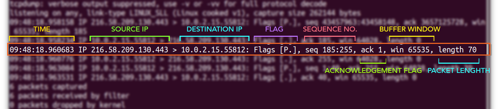
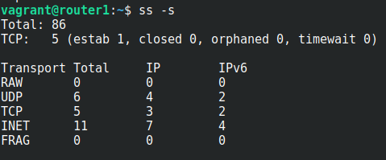

# TCPDUMP

## USARE -l SE SI CONCATENA CON un pipe

Vedere tutte le interfacce

```bash
tcpdump -D  
```

Scegliere una interfaccia o TUTTE

```bash
tcpdump -i eth1|any
```

Numero massimo di pacchetti da catturare per quella interfaccia 

```bash
tcpdump -i eth1 -c 3
```

Pulisce l’output eliminando nome e porta ( solo n nome due n anche la porta)

```bash
tcpdump -i eth1  -c 3  -nn   
```

Catturare i pacchetti da un dato host

```bash
tcpdump -i any -c4 host 10.0.2.15
```

Catturare filtrando per porta

```bash
tcpdump -i any -c3 -nn port 443
```

Catturare per protocollo

```bash
tcpdump -i any -c6 udp
```

Catturare con diversi filtri usando l’and logico

```bash
tcpdump -i any -c6 -nn host 10.0.2.15 **and** port 443
```

Storage dei pacchetti in file pcap

```bash
tcpdump -i any -c5 -w packetData.pcap
```

Leggere i file pcap

```bash
tcpdump -r packetData.pcap
```

**Capire il formato dell’output**


**Le flags**

| Flag | Type | Description |
|------|------|-------------|
| "."  | ACK  | Signifies acknowledgment |
| S    | SYN  | Flag for starting a connection |
| F    | FIN  | Flag for closed a connection |
| P    | PUSH | Indicates the push of data from the sender |
| R    | RST  | Connection Reset |

BY **Source o destination**

```bash
tcpdump src 1.1.1.1
tcpdump dst 1.0.0.1
```

**To or from another subnet**

```bash
tcpdump net 1.2.3.0/24
tcpdump src net 1.2.3.0/24 and dst net 1.2.4.0/24
```

Attenzione mettendo any catturiamo 2 volte il pacchetto, quando entra e quando esce 

# SS

Programma utile per informazioni sulle socket del sistema

Mostrare tutti i socket

```bash
ss -a
```

Mostrare i socket in ascolto

```bash
ss -l
```

Mostrare anche info sui processi

```bash
ss -p
```

Mostra info sommarie

```bash
ss -s
```



Mostra solo socket per ipv4

```bash
ss -4
```

Mostrare solo tcp o udp

```bash
ss -t | -u
```

Mostra NON HUMAN READABLE quindi con i **numeri** al posto delle **parole** i nomi dei servizi

```bash
ss -n
```

## Inizio e fine connessioni tcp

```bash
sudo tcpdump -vnl -i any src net 10.1.1.0/24 and dst net 10.2.2.0/24 and dst port 22 and  'tcp[tcpflags] & (tcp-syn|tcp-fin) != 0'
```